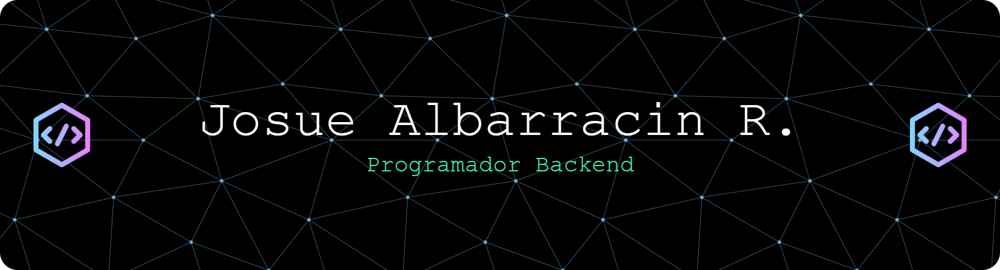

# Hola soy Josue, que te trae por aqui compañero de codigo.

<em>Estudiante de la carrera de Ingeniería Informática en ruta a ser un Backend buscando siempre aprender y
mejorar mis habilidades como desarrolador.</em>

## Habilidades

#### 🌐 Programación web

#### 🖼️ Lenguajes de programación

#### ⛈️ Bases de datos

#### 🖥️ Extras:

